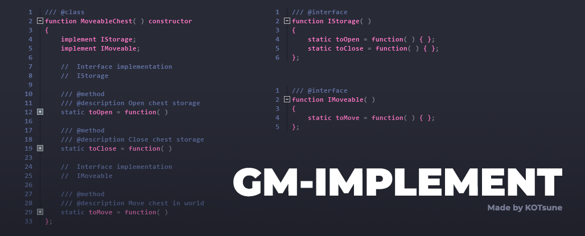

### GM-Implement - [Русская версия](README_ru.md)

A simple extension that allows you to define interfaces in a simple form and implement them in constructor functions or objects. This extension is designed for **debugging**: the game will inform you about a fatal interface implementation error during the compilation if you forget to define one of its methods
